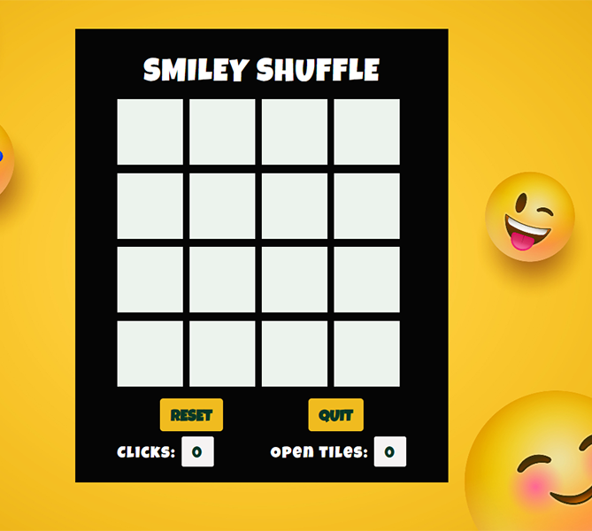

# 🎮 Smile Shuffle

**Smile Shuffle** is a fun and interactive browser-based game built with **JavaScript (OOP)** and **CSS**. It's designed to bring a smile to your face as you shuffle through different animated characters or icons — great for quick entertainment and practice in front-end logic.

## 🧠 What I Learned

- JavaScript Object-Oriented Programming (OOP) principles
- Modular JavaScript with reusable class components
- CSS animations and transitions
- DOM manipulation and event handling
- Game logic structuring and state management

## ✨ Features

- 😄 Shuffle characters or emojis to match or create patterns
- 🧩 Game logic structured with clean OOP classes
- 🎨 Stylish UI using  CSS
- 🔁 Smooth transitions and interactive gameplay

## 🚀 Technologies Used

- JavaScript (ES6+)
- CSS3
- HTML5

## 🛠️ Getting Started

Clone the repository:
<pre>
git clone https://github.com/shanikauwu1/smile-shuffle.git
cd smile-shuffle
</pre>

## 📸 Screenshots

## 🔗 Live Demo
 [View Live Project](https://shanikacode.in/smily-shuffle/)

## 📬 Contact
Created by [Shanika Ekanayake](https://shanikacode.in/)
